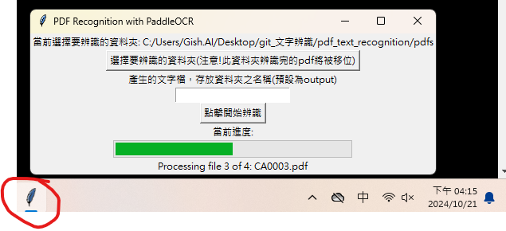

# pdf_text_recognition
side_project_姑姑中華經研院文字辨識需求

將圖檔(需求為PDF)經OCR辨識產生出文字檔的小工具

需求：將一本一本書的圖檔(來源為PDF)轉為純文字，以供後續分析(RAG based)使用

因檔案太大無法上傳至git，我存到google drive，以下網址可下載可使用的執行檔  
https://drive.google.com/file/d/1h6CwzvTACbjsJDo10YKmpbstmrNFu6Vw/view?usp=drive_link  
20241021 release初版 測試可執行  

建議在好一點的CPU的電腦上執行，差一點的電腦執行的話整個畫面會卡卡的，幾乎完全無法做其他事，也很容易中間過程辨識出問題失敗  

準度會因圖檔的良率(如傾斜、髒汙等)而有變動，如果準確度太低歡迎洽談我(lineID willyshao514)

### 執行方式

下載上面的google drive連結，zip檔案解壓縮，執行裡面的exe檔案，會跑出一個小介面(如果沒有的話應該就是被縮小了，請在下方工具列打開一個羽毛圖案的視窗)  
先點選上面的按鈕選擇要辨識的資料夾(裡面放pdf檔案，程式也只會抓副檔名為pdf的檔案)  
然後點選下面的開始辨識按鈕

如圖  
  

執行完後，存放此程式的資料夾裡面會有四個子資料夾，  
(1)error  
辨識失敗的pdf會被移到這裡  
(2)pass  
辨識成功的pdf會被移到這裡  
(3)log  
啟動一次會有兩個檔案，error_log紀錄失敗原因與時間戳記，跟processing_log紀錄花費時間跟時間戳記  
(4)output  
產生之文字檔會放在這  

我選擇處理pdf辨識後用移位的 因為覺得會浪費存儲空間  
如果怕檔案遺失的話 就將要辨識的PDF檔複製出來到一個隨便的資料夾 用程式跑該資料夾即可  

### 速度問題

當前版本使用的是CPU版本，GPU會快很多，但是要裝對應的cuda跟cudnn，根據每張顯卡的版本要裝不同的版，會有點麻煩，  
這部分要弄的話就是希望可以去現場或者遠端操控需要裝gpu版本的電腦直接安裝  

### environment (從這裡開始，非開發者可無視)  

參考 https://github.com/PaddlePaddle/PaddleOCR/blob/main/doc/doc_en/quickstart_en.md  

conda create --name pdf_recog python=3.10  
activate pdf_recog # venv  

pip install paddlepaddle-gpu # <= gpu version  
OR
python -m pip install paddlepaddle  

pip install PyMuPDF  
pip install albumentations  
pip install tkinter  

### 打包成exe  

用pyinstaller無法成功，  
參考解決方案 : https://github.com/PaddlePaddle/PaddleOCR/discussions/11490  
另外還要在--hidden-import裡面加入fitz  
執行auto-py-to-exe成功後，  
會在output資料夾產生出此程式exe的資料夾，我將該資料夾壓縮成zip，存在dist資料夾裡面  

20241022 測試16核i5-12500 在開啟部分應用程式情況下 執行辨識三本一百多頁的pdf檔案 其中一本因辨識過程中有操作電腦做其他文書處理事務，當時很卡(補充-當時有開chrome好幾個分頁+三個背景通訊軟體程式)  
，幾乎動不了電腦，後來發現此舉動會造成辨識失敗  
之後兩本pdf成功辨識  
一本pdf約一小時(三個檔案執行時間約8000秒)  

16核i7-11700電腦在執行辨識程式情形下還能玩遊戲，似乎比較不卡(補充:較少chrome分頁跟沒有背景通訊軟體程式)?  

#### 20241022 issues   

(1)  
[2024-10-22 09:56:15] Error processing AAAAAAAAAAAAAAAAAAAAAAAAAA.pdf:
Traceback (most recent call last):
  File "paddleOCR_pdftotxt.py", line 94, in start_processing
  File "paddleocr\paddleocr.py", line 760, in ocr
    dt_boxes, rec_res, _ = self.__call__(img, cls, slice)
  File "C:\Users\johnson5803\Desktop\paddleOCR_pdftotxt\_internal\paddleocr\tools\infer\predict_system.py", line 134, in __call__
    img_crop_list, angle_list, elapse = self.text_classifier(img_crop_list)
  File "C:\Users\johnson5803\Desktop\paddleOCR_pdftotxt\_internal\paddleocr\tools\infer\predict_cls.py", line 115, in __call__
    prob_out = self.output_tensors[0].copy_to_cpu()
RuntimeError: (PreconditionNotMet) Tensor holds no memory. Call Tensor::mutable_data firstly.
  [Hint: holder_ should not be null.] (at ..\paddle\phi\core\dense_tensor_impl.cc:44)

(2)  
[2024-10-22 10:27:45] Error processing BBBBBBBBBBBBBBBBBBBBBBBBB.pdf:
Traceback (most recent call last):
  File "paddleOCR_pdftotxt.py", line 94, in start_processing
  File "paddleocr\paddleocr.py", line 760, in ocr
    dt_boxes, rec_res, _ = self.__call__(img, cls, slice)
  File "C:\Users\johnson5803\Desktop\paddleOCR_pdftotxt\_internal\paddleocr\tools\infer\predict_system.py", line 109, in __call__
    dt_boxes, elapse = self.text_detector(img)
  File "C:\Users\johnson5803\Desktop\paddleOCR_pdftotxt\_internal\paddleocr\tools\infer\predict_det.py", line 396, in __call__
    dt_boxes, elapse = self.predict(img)
  File "C:\Users\johnson5803\Desktop\paddleOCR_pdftotxt\_internal\paddleocr\tools\infer\predict_det.py", line 255, in predict
    self.predictor.run()
RuntimeError: could not create a primitive

看起來兩個查了一下都是CPU內存(RAM)不足導致  

#### 20241022 嘗試使用自己的電腦來執行上面兩個在姑姑那邊電腦有問題的pdf檔案

我電腦規格如下  
  

[2024-10-22 11:14:20] PR0002中共對我外貿競爭威脅及我方因應對策(1).pdf processed successfully in 417.56 seconds  <=   148頁   
[2024-10-22 12:40:08] 乙篇－新投資機會產品項目清單.pdf processed successfully in 5148.14 seconds  <=  883頁   

假設規格太差而不能執行(如RAM不夠導致out of memory)  
想到的可能方案：做個資料前處理 將PDF以100頁做分割 比如一個1000頁的PDF拆成十個100頁的檔案再餵入PaddleOCR  
